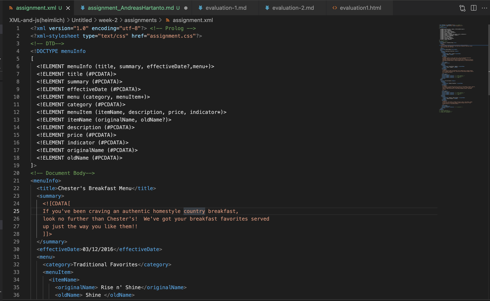
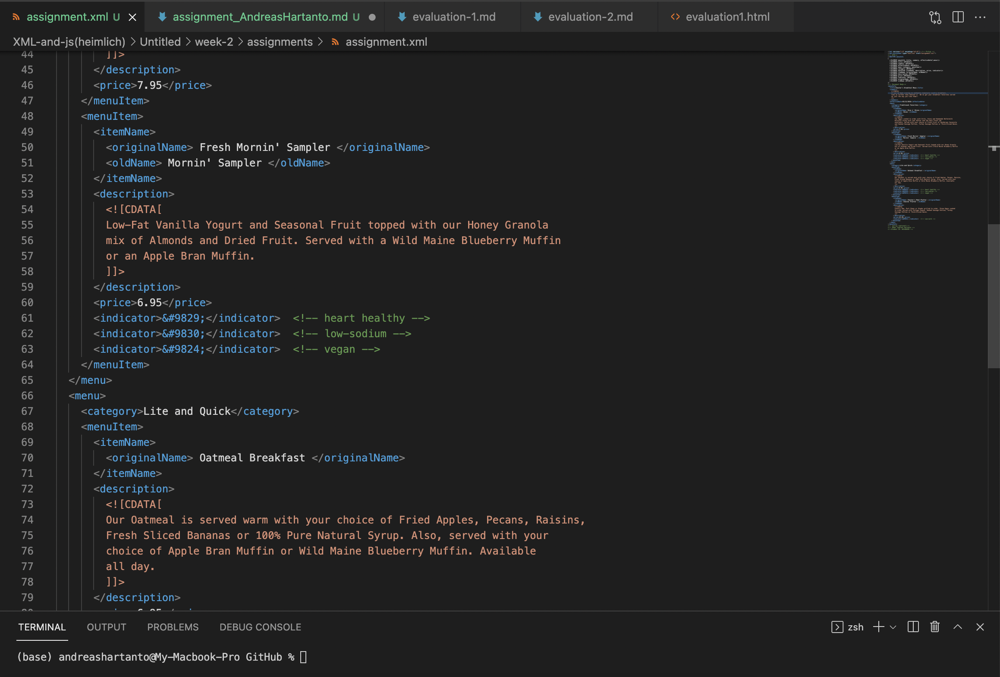
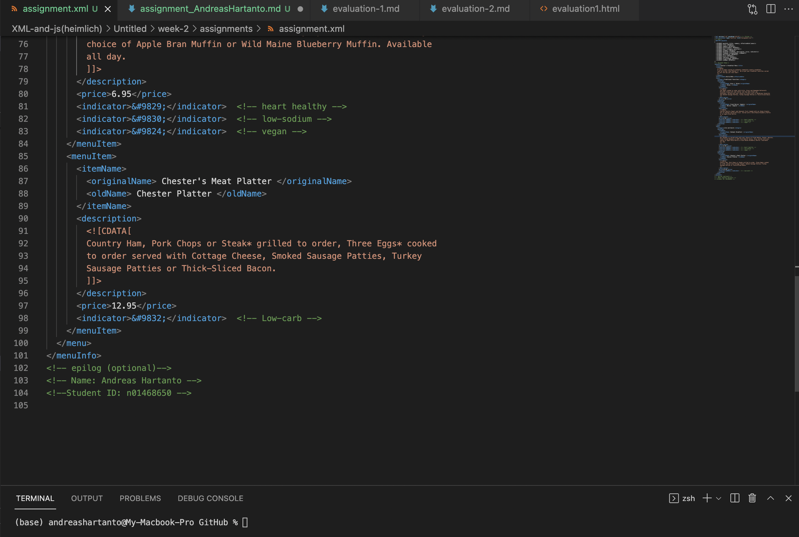
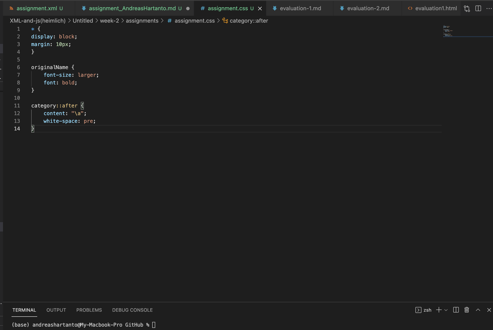

# W2 Assignment 1
/// Name: Andreas Hartanto ///
/// Student ID: n01468650  ///

1. Open `week-2/assignments/assignment.xml` in your browser. Are there any errors? Explain the error and fix it.
# Errors found on the xml file is attribute name has space (effective Date and the correct one is effectiveDate)

2. What is the use of CDATA block in this document?
# to ensure the structure/section of xml document so that parser intreprets it only as character data. 

3. Add comment line to the end of file which contains you name and student id.
# added

4. Identify prolog, document body, and epilog in the document. Are there any processing instructions?
# Prolog is the declaration part (marked on document)
# document body is the part with element, attributes, and tags (marked on document)
# epilog is the optional comment at the end of the body. in this case name and student id (marked on document)

5. Add inline DTD for this document.
# added and marked on document

6. Verify that file is well-formed and valid.
# validated 

7. Create `style.css` file and link it to the file. Add the following styles to the .css:
# added 
- Change font-size of `originalName`
- Display each `category` on the new line
- Add any other css-rule

